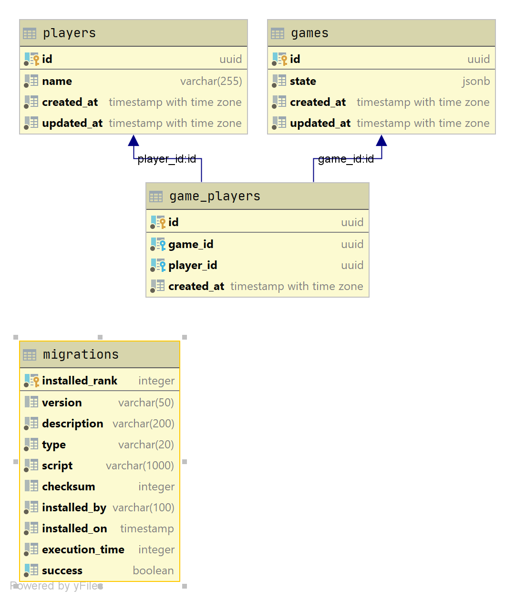

# tic-tac-toe

Web server hosted tic-tac-toe game

## Installation

```bash
docker-compose build
docker-compose up -d postgres
lein flyway migrate
```

## Schema




## Usage

Deleting and recreating the postgres database
```bash
docker-compose down
docker volume rm ttt_database-data
docker-compose up -d postgres
lein flyway migrate
```

Connecting to the database
```bash
docker-compose exec postgres psql -h localhost -p 5432 -U postgres tic_tac_toe

# Creating users:
docker-compose exec postgres psql -h localhost -p 5432 -U postgres tic_tac_toe -c "insert into players (name) values ('adam'),('ben'),('colin');"
```

Starting the web server:
```bash
lein run
```

## Testing from the command line

```bash
# Fetching the list of players
curl -v -H @headers-adam.txt localhost:3000/api/players

# Creating a new game
curl -v -X POST -H @headers-adam.txt localhost:3000/api/games/new?other-player-id=61a395d5-9657-415e-9c86-853cedd3a12e

# Viewing a user's most recent game
curl -v -H @headers-adam.txt localhost:3000/api/games/latest/

# Playing
curl -v -X POST -H @headers-adam.txt "localhost:3000/api/games/latest/move?row=1&column=1"
curl -v -X POST -H @headers-ben.txt "localhost:3000/api/games/latest/move?row=1&column=0"
curl -v -X POST -H @headers-adam.txt "localhost:3000/api/games/latest/move?row=2&column=2"
# 
```
 
## TODO

- [] Add a UI! - Maybe using react?
- [] Add push notifications 
- [] Replace println statements with a logging library


